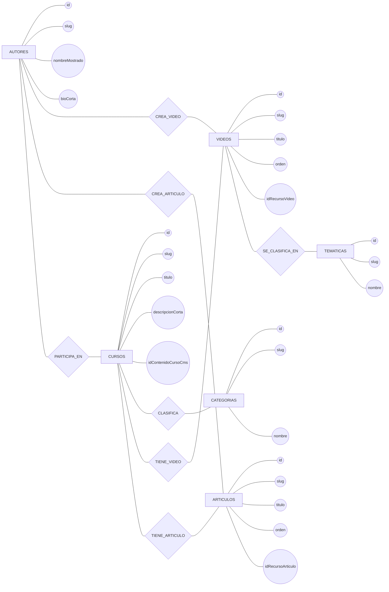

# Diagrama de Chen (parte básica)

El modelo de Chen representa el nivel conceptual:
- **Entidades** (rectángulos)
- **Atributos** (óvalos)
- **Relaciones** (rombos)

## Cardinalidades (lectura de Chen)

- `CATEGORIAS 1:N CURSOS`
- `CURSOS 1:N VIDEOS`
- `CURSOS 1:N ARTICULOS`
- `AUTORES 1:N VIDEOS`
- `AUTORES 1:N ARTICULOS`
- `TEMATICAS 1:N VIDEOS`
- `AUTORES N:M CURSOS` (en físico se resuelve con `cursos_autores`)
