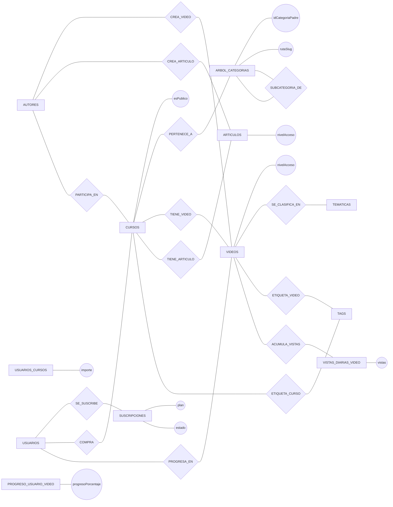

# Diagrama de Chen (parte opcional)

Este diagrama conceptual amplía la parte básica con:
- Jerarquía de categorías.
- Acceso público/privado.
- Suscripciones y compras.
- Tags, progreso y visualizaciones.

## Cardinalidades (lectura de Chen)

- `ARBOL_CATEGORIAS 1:N CURSOS`
- `ARBOL_CATEGORIAS 1:N ARBOL_CATEGORIAS` (autorrelación padre-hijo)
- `CURSOS 1:N VIDEOS`
- `CURSOS 1:N ARTICULOS`
- `AUTORES 1:N VIDEOS`
- `AUTORES 1:N ARTICULOS`
- `AUTORES N:M CURSOS`
- `USUARIOS 1:N SUSCRIPCIONES`
- `USUARIOS N:M CURSOS` (compra puntual)
- `CURSOS N:M TAGS`
- `VIDEOS N:M TAGS`
- `USUARIOS N:M VIDEOS` (progreso)
- `VIDEOS 1:N VISTAS_DIARIAS_VIDEO`
